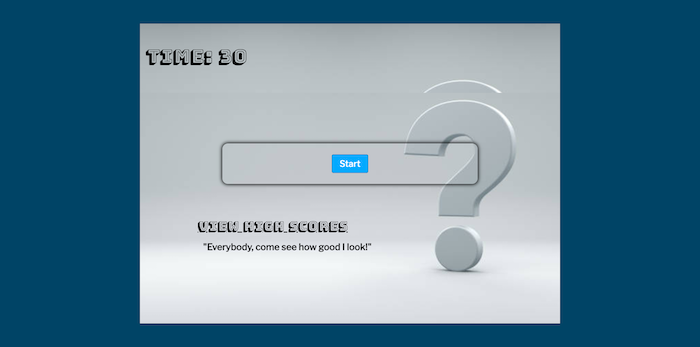

# 04-Web-APIs-Code-Quiz

## Description 
Purpose of this project is to create a timed JavaScript quiz, where users may save their score to their local storage after completing the coding quiz challenge by entering their initials. All the saved scores can be viewed on the high-scores page, where the user may choose to clear or save the scores. 

The quiz is made up of 5 questions. The user has 30 seconds to compleat the quiz.  If the user gets a question wrong, 5 seconds are deducted from the timer. The game ends once the user hits 0 seconds or he answers all the questions and submits his instals. 

## Table of Contents
* [Features](#Features)
* [Installation](#installation)
* [Usage](#usage)
* [License](#license)
* [Badges](#Badges)

## Features
- JavaScript
- if, if else
- setTime
- Local Storage
- DOM manipulation 
- .remove, .forEach, array.from
- JSON.parse

## Installation 

NO installation required you can view the page. If you want to look at my code, do a git clone or my repository. 

[Link to website](https://jmnfire.github.io/04-Web-APIs-Code-Quiz/)

## Usage

## License 

MIT License
Copyright (c) 2021 Jovan Nixon
Permission is hereby granted, free of charge, to any person obtaining a copy
of this software and associated documentation files (the "Software"), to deal
in the Software without restriction, including without limitation the rights
to use, copy, modify, merge, publish, distribute, sublicense, and/or sell
copies of the Software, and to permit persons to whom the Software is
furnished to do so, subject to the following conditions:
The above copyright notice and this permission notice shall be included in all
copies or substantial portions of the Software.
THE SOFTWARE IS PROVIDED "AS IS", WITHOUT WARRANTY OF ANY KIND, EXPRESS OR
IMPLIED, INCLUDING BUT NOT LIMITED TO THE WARRANTIES OF MERCHANTABILITY,
FITNESS FOR A PARTICULAR PURPOSE AND NONINFRINGEMENT. IN NO EVENT SHALL THE
AUTHORS OR COPYRIGHT HOLDERS BE LIABLE FOR ANY CLAIM, DAMAGES OR OTHER
LIABILITY, WHETHER IN AN ACTION OF CONTRACT, TORT OR OTHERWISE, ARISING FROM,
OUT OF OR IN CONNECTION WITH THE SOFTWARE OR THE USE OR OTHER DEALINGS IN THE
SOFTWARE.

## Badges

